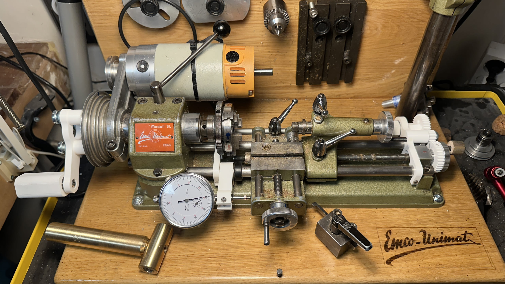
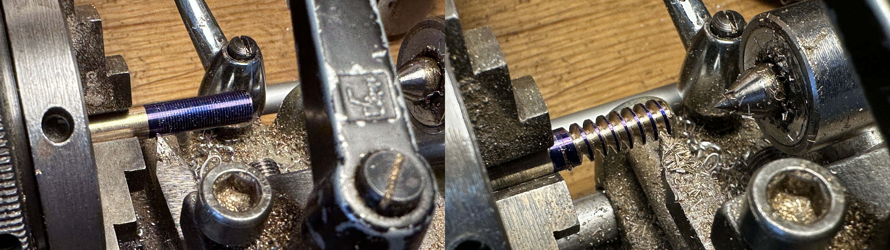

# Thread cutting attachment for Emco Unimat SL microlathe

**WARNING** Never power up the lathe with the threading gears attached!
The 3D printed pieces are designed for hand-operation only.
Remove the gear from the cross shaft before engaging the motor.

## Setup

* Paint the section to be threaded.
* Set an end stop for the carriage.
* Move the carriage to the right side of the threaded section.
* Feed the tool in until it just makes contact.
* Install the correct change gears for the desired thread pitch.
* Feed the carriage either with the handwheel or by turning the spindle.
* At the end of the threaded section, back out the tool a whole turn.
* Return the carriage to the start of the threaded section.
* Feed in the tool 0.1 or 0.2mm further and repeat.

## Pitches

Thread pitch is controlled by installing a gear T1 on the crossshaft and T2 on the spindle.
The 0.5 fine pitch on the left is with the 30 on the cross shaft and the 60 on the spindle,
while the 2.0 coarse pitch on the right is with the 60 on the cross shaft and 30 on the spindle.

All of the combinations sum to 90 teeth and the spacing between cross shaft and spindle is 54mm.
This is means a 1.2 modulus for the gears (45 tooth * 1.2 module == 54mm diameter).

Pitch | T1 | T2 | Err % | Usage
------|----|----|-------|------
 0.25 | 18 | 72 | +0.00 | M2 fine
 0.35 | 23 | 67 | +0.67 | M3 fine
 0.40 | 26 | 64 | -0.62 | M2
 0.50 | 30 | 60 | +0.00 | M3, M4 fine, M5 fine
 0.70 | 37 | 53 | +0.19 | M4
 0.75 | 39 | 51 | -1.47 | M6 fine
 0.80 | 40 | 50 | +0.00 | M5
 1.00 | 45 | 45 | +0.00 | M6, M8 fine, M12 spindle
 1.25 | 50 | 40 | +0.00 | M8, M10 fine
 1.50 | 54 | 36 | +0.00 | M10, M12 fine, M14 fine
 1.75 | 57 | 33 | +2.27 | M12 
 2.00 | 60 | 30 | +0.00 | M14

60 teeth is the largest that fits on the cross shaft, but you probably aren't turning bigger than M14 on
this itty bitty lathe anyway.

## Parts

The cross shaft is 8mm aluminum from the hardware store.

The bearings are 8mm ID, 22mm OD skate bearings and press fit into the printed mounting bracket.

The reversing gear doesn't have a bearing due to clearance issues, although it probably should.

The set screw for the feedwheel handle is M2.5.

All other hardware is M3.

